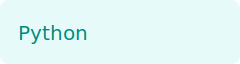
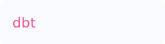
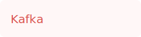
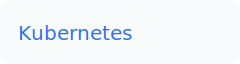
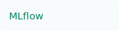
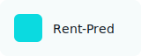
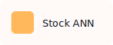
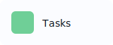
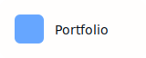
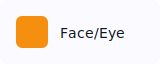

# Venkat Sai

Hi — I'm Venkat. I design and build production-ready ML systems, scalable ETL pipelines, and analytics products that convert data into measurable business outcomes. I focus on reliability, maintainability, and measurable impact — shipping models and pipelines that run in production and delight stakeholders.

Contact: [venkatasaichag@gmail.com](mailto:venkatasaichag@gmail.com) • LinkedIn: [add-your-linkedin-here](#)

---

## Quick overview
- Role: Data Scientist • ML Engineer • Data Engineer • Analytics Engineer  
- Focus: production ML, streaming & batch pipelines, dbt-enabled analytics, and BI that drives decisions.

---

## Skills & Tools
Below are core skills and tools with small SVG logos (place logos in `/assets/logos/` if you swap them):

  
  
  
  
  
  
  
  
  
  

---

## Current project
**Real-time Fraud Detection (Production)**  
- Stack: Kafka → Spark Structured Streaming → XGBoost → Docker → Seldon  
- Status:   
- One-line impact: Reduced false positives by ~42% and processes 50k events/sec.  
- Visual placeholder: `assets/project-fraud.svg` (replace with `project-fraud.gif` or PNG for demo)

---

## Pinned repositories (click a card to open the repo)
The layout below is designed to behave like repo tiles. Each card is a direct link to the repo URL on GitHub (replace the href targets with your real repo links if different).

  <a href="https://github.com/debugger-sr/Rent-Prediction" target="_blank" rel="noopener noreferrer" style="text-decoration:none; color:inherit;">
    

      

        
        

          
Rent-Prediction

          
Forked from yarradedeepya / Jupyter Notebook demo for housing rent estimation

        

      

      

        

           Jupyter Notebook
        

        
Public

      

    

  </a>

  <a href="https://github.com/debugger-sr/Stock_prediction_Using-ANN" target="_blank" rel="noopener noreferrer" style="text-decoration:none; color:inherit;">
    

      

        
        

          
Stock_prediction_Using-ANN

          
ANN based stock prediction demo (not investment advice)

        

      

      

        

           Python, Keras
        

        
Public

      

    

  </a>

  <a href="https://github.com/debugger-sr/task-tracker-app" target="_blank" rel="noopener noreferrer" style="text-decoration:none; color:inherit;">
    

      

        
        

          
task-tracker-app

          
Small web app: task management using HTML/CSS/JS

        

      

      

        

           HTML
        

        
Public

      

    

  </a>

  <a href="https://github.com/debugger-sr/Venkata_Portfolio" target="_blank" rel="noopener noreferrer" style="text-decoration:none; color:inherit;">
    

      

        
        

          
Venkata_Portfolio

          
Personal portfolio site (HTML/CSS)

        

      

      

        

           HTML
        

        
Public

      

    

  </a>

  <a href="https://github.com/debugger-sr/Face-and-Eye-Detection-Using-OpenCV" target="_blank" rel="noopener noreferrer" style="text-decoration:none; color:inherit;">
    

      

        
        

          
Face-and-Eye-Detection-Using-OpenCV

          
Real-time face & eye detection using OpenCV

        

      

      

        

           Jupyter Notebook
        

        
Public

      

    

  </a>

---

## How this works and how to update
- Each card is an anchor (<a>) that links directly to the repo URL — clicking opens the repository in a new tab.
- Logos: place each repo's small logo or an SVG in `/assets/repo-logos/` and name them:
  - `rent-prediction.svg`
  - `stock-prediction.svg`
  - `task-tracker-app.svg`
  - `venkata-portfolio.svg`
  - `face-eye-detection.svg`
- Skill/tool logos are in `/assets/logos/`. Use SVGs for crisp rendering.
- To add/remove repos, copy a card block and update the href + text + image path.
- Colors & spacing are kept simple: teal-accent headings, soft border, subtle shadow, compact font sizes for readability.

---

If you'd like, send me:
- the exact LinkedIn URL to wire into the header,
- any repo links that differ from the ones I used, or
- the real small logos / GIFs (I will place them in `/assets/` and update the README and push everything when you confirm: `Push README to my profile`).
