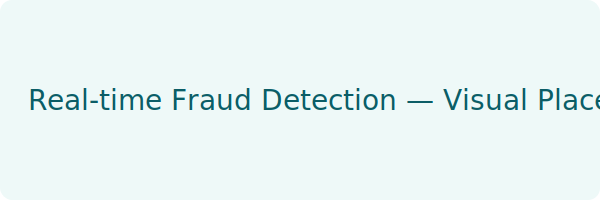

# Venkat Sai

Hi — I'm Venkat. I design and build production-ready ML systems, scalable ETL pipelines, and analytics products that convert data into measurable business outcomes. I focus on reliability, maintainability, and measurable impact — shipping models and pipelines that run in production and delight stakeholders.

Contact: [venkatasaichag@gmail.com](mailto:venkatasaichag@gmail.com) • LinkedIn: [add-your-linkedin-here](#)

---

## Quick overview
- Role: Data Scientist • ML Engineer • Data Engineer • Analytics Engineer  
- Focus: production ML, streaming & batch pipelines, dbt-enabled analytics, and BI that drives decisions.

---

## Skills & Tools
Below are core skills and tools with small SVG logos (place logos in `/assets/logos/` if you swap them):

  
  
  
  
  
  
  
  
  
  

---

## Current project
**Real-time Fraud Detection (Production)**  
- Stack: Kafka → Spark Structured Streaming → XGBoost → Docker → Seldon  
- Status:   
- One-line impact: Reduced false positives by ~42% and processes 50k events/sec.  
- Visual: below (click the project card to open the repo)

---

## Pinned repositories (click a card to open the repo)
The layout below is designed to behave like repo tiles. Each card is a direct link to the repo URL on GitHub (clicking anywhere on the tile will redirect to the repository in the same tab).

  <a href="/debugger-sr/Rent-Prediction" class="repo-card">
    

      
      

        
Rent-Prediction

        
Forked from yarradedeepya / Jupyter Notebook demo for housing rent estimation

      

    

    

      
 Jupyter Notebook

      
Public

    

  </a>

  <a href="/debugger-sr/Stock_prediction_Using-ANN" class="repo-card">
    

      
      

        
Stock_prediction_Using-ANN

        
ANN based stock prediction demo (not investment advice)

      

    

    

      
 Python, Keras

      
Public

    

  </a>

  <a href="/debugger-sr/task-tracker-app" class="repo-card">
    

      
      

        
task-tracker-app

        
Small web app: task management using HTML/CSS/JS

      

    

    

      
 HTML

      
Public

    

  </a>

  <a href="/debugger-sr/Venkata_Portfolio" class="repo-card">
    

      
      

        
Venkata_Portfolio

        
Personal portfolio site (HTML/CSS)

      

    

    

      
 HTML

      
Public

    

  </a>

  <a href="/debugger-sr/Face-and-Eye-Detection-Using-OpenCV" class="repo-card">
    

      
      

        
Face-and-Eye-Detection-Using-OpenCV

        
Real-time face & eye detection using OpenCV

      

    

    

      
 Jupyter Notebook

      
Public

    

  </a>

---

## How this works and how to update
- Each card is an anchor (<a>) that links directly to the repo URL — clicking the card will redirect you to the repository in the same tab. If you'd rather open in a new tab, I can change anchors to use target="_blank".
- Logos: place each repo's small logo or an SVG in `/assets/repo-logos/`.
- Skill/tool logos are in `/assets/logos/`. SVGs are recommended for crisp rendering.
- To add/remove repos, copy a card block and update the href + text + image path.

---

If you'd like, send me:
- the exact LinkedIn URL to wire into the header,
- any repo links that differ from the ones I used, or
- prefer different images/GIFs (I can swap them). If you want me to replace any SVGs with GIFs/PNGs I added, tell me which paths to replace and I will push them in a single commit.